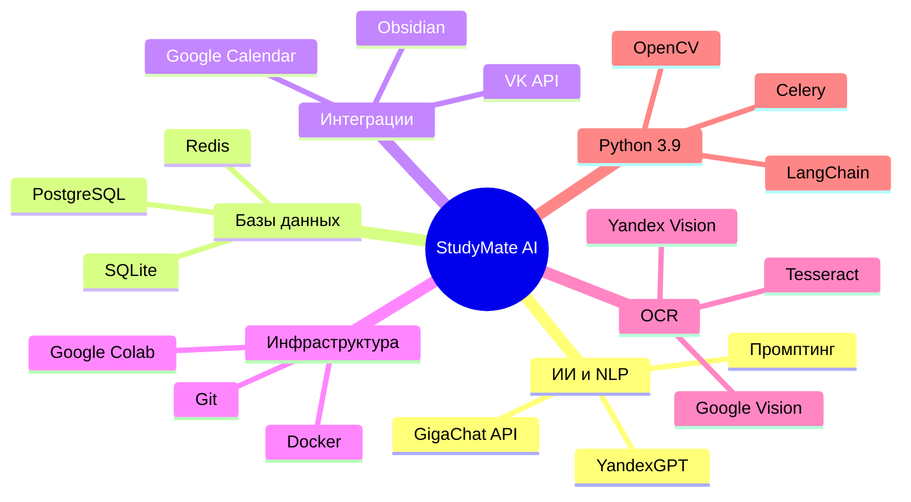

<h1 align="center">💜 Здравствуйте, Александра Николаевна! 💜</h1> 

  

<h2 align="center">👾 Мы рады снова вас видеть! 👾</h2> 

На этой странице всё-всё о нашем проекте по дисциплине ИТ-практикум!
 

🟣 Посмотрим, сможете ли вы составить своё расписание 🟣
 

## 🟪 Содержание

- [🟣 Описание функционала]()
  
- [🟣 Архитектура решения]()

- [🟣 Техническая документация]()

- [🟣 Вклад участников]()

 

  

   

<h2 align="center">👾</h2> 

Мы создали интеллектуальный помощник в социальной сети ВКонтакте для того, чтобы взять на себя рутину планирования и сделать процесс обучения более осознанным и эффективным.
 

<h2 align="center">👾</h2> 

В отличие от обычных календарей, наш бот не просто хранит расписание, а активно взаимодействует со студентом: он анализирует загруженные данные, прогнозирует учебную нагрузку и с помощью ИИ генерирует персонализированные материалы для подготовки.
 

<h2 align="center">👾</h2> 

Основная задача бота – закрыть разрыв между постановкой задачи и её выполнением, превращая хаотичный список дел в понятную систему с напоминаниями, декомпозицией сложных проектов и интеллектуальными карточками для повторения.
 

   

  

   

  

   

## 🟪 Анализ требований и ограничений

 

| Требование |	Влияние на архитектуру |
| ------------- | ------------- |
| **Работа в Google Colab** |	Модульность, отсутствие привязки к конкретному серверу, возможность запуска в notebook-среде. |
| **Использование русских нейросетей (GigaChat)**	| Необходимость слоя абстракции для работы с API, обработка авторизации и токенов. |
| **Хранение пользовательских данных** |	Легковесная БД (SQLite), совместимая с Colab и локальным запуском. |
| **Понятный текстовый интерфейс** |	Разделение логики и представления (архитектура MVC в упрощенном виде). |
| **Интеграция с внешними сервисами (Google Calendar, Obsidian)** |	Паттерн "Адаптер" для каждого внешнего сервиса. |
| **Возможность масштабирования на 1-5 предметов** |	Монолитная модульная архитектура (микросервисы избыточны). |

 

## 🟪 Обоснование выбора архитектурного стиля

 

1. Модульный монолит (Modular Monolith)

Мы выбрали модульный монолит как основной архитектурный стиль по следующим причинам:

- 🟣 Простота разработки и отладки.

- 🟣 Легкость развертывания.

- 🟣 Возможность распараллелить разработку.

- 🟣 При необходимости масштабирования.

 

2. Луковая архитектура (Onion Architecture)

Для организации кода внутри монолита используется луковая архитектура: 

🧅Ядро (Core) --> 🧅Сервисы (Services) --> 🧅Инфраструктура (Infrastructure) --> 🧅Представление (Presentation) 

3. Паттерны проектирования

 

| Паттерн |	Где применяется? |	Зачем? |
| ------------- | ------------- | ------------- |
| **Фасад (Facade)** |	gigachat_connector.py |	Упрощает работу со сложным API GigaChat. |
| **Репозиторий (Repository)** |	database.py |	Абстрагирует работу с БД, скрывая SQL-запросы. |
| **Наблюдатель (Observer)** |	reminder_system.py |	Проверка условий и отправка уведомлений. |
| **Стратегия (Strategy)** |	Обработка расписания |	Разные способы ввода (ручной/OCR) реализованы как взаимозаменяемые алгоритмы. |
| **Одиночка (Singleton)** |	Подключение к БД |	Гарантирует одно соединение на всю программу. |

 

## 🟪 Схема архитектуры

 

<pre>
┌─────────────────────────────────────────────────────────────┐
│                   КЛИЕНТСКИЙ СЛОЙ                           │
│  ┌─────────────────────────────────────────────────────┐    │
│  │         main.ipynb (Текстовый интерфейс Colab)      │    │
│  └─────────────────────────────────────────────────────┘    │
└─────────────────────────────────────────────────────────────┘
                              │
                              ▼
┌─────────────────────────────────────────────────────────────┐
│                   СЛОЙ БИЗНЕС-ЛОГИКИ                        │
│  ┌──────────────┐  ┌──────────────┐  ┌──────────────┐       │
│  │ reminder_    │  │ task_helper  │  │ schedule_    │       │
│  │ system.py    │  │ .py          │  │ service.py   │       │
│  └──────────────┘  └──────────────┘  └──────────────┘       │
└─────────────────────────────────────────────────────────────┘
          │                   │                  │
          ▼                   ▼                  ▼
┌─────────────────────────────────────────────────────────────┐
│                СЛОЙ API И ИНТЕГРАЦИЙ                        │
│  ┌──────────────┐  ┌──────────────┐  ┌──────────────┐       │
│  │ gigachat_    │  │    OCR-      │  │  Интеграция  │       │
│  │ connector.py │  │   модуль     │  │   с Obsidian │       │
│  └──────────────┘  └──────────────┘  └──────────────┘       │
└─────────────────────────────────────────────────────────────┘
          │                   │                  │
          ▼                   ▼                  ▼
┌─────────────────────────────────────────────────────────────┐
│                СЛОЙ ДОСТУПА К ДАННЫМ                        │
│  ┌─────────────────────┐  ┌─────────────────────┐           │
│  │   database.py       │  │   Файловая система  │           │
│  │   (SQLite)          │  │   data/             │           │
│  └─────────────────────┘  └─────────────────────┘           │
└─────────────────────────────────────────────────────────────┘
          │                   │
          ▼                   ▼
┌─────────────────────────────────────────────────────────────┐
│                   ВНЕШНИЕ СЕРВИСЫ                           │
│  ┌──────────────┐  ┌──────────────┐  ┌──────────────┐       │
│  │ GigaChat API │  │   VK API     │  │ Google Drive │       │
│  └──────────────┘  └──────────────┘  └──────────────┘       │
└─────────────────────────────────────────────────────────────┘
</pre>

 

  

<h2 align="center">👾</h2> 

С технической точки зрения наш проект – это интеллектуальный ORM-конвейер, объединяющий возможности обработки естественного языка, оптического распознавания символов и классического планировщика задач.
 

<h2 align="center">👾</h2> 

Система спроектирована так, чтобы быть полностью кроссплатформенной и работать в среде Google Colab, что позволяет запускать её с любого устройства без сложной настройки.
 

   

   
 

  

   

| Участник           | Роль | Зона ответственности |
| ------------- | ------------- | ------------- |
| **Свистун Софья** | ⚙️ Хранитель Git | Полное ведение репозитория: создание и заполнение ReadMe, контроль количества коммитов (минимум 45 на команду), управление организацией в Git. |
| **Хархавкина Мария** | 📜 Летописец | Создание, ведение и заполнение итогового отчёта. Описание работы каждого члена команды. Подготовка научных тезисов (постановка задачи, подход, архитектура, результаты). |                                                                                        
| **Мирошник Мария** | 🎤 Маг презентации | Выступление и полное оформление презентации (слайды 24+). Создание коммерческой презентации продукта (проблема, ЦА, ценность, демо). А также: добровольное согласие на получение пинков за всю команду. |                                                                            
| **Микуров Дмитрий** | 💻 Фулл-стек разработчик | Разработка модулей: database.py (структура БД, работа с расписанием и дедлайнами), reminder_system.py (умные напоминания), task_helper.py (разбивка задач на шаги), а также главный интерфейс main.ipynb. |                             
| **Кокорев Михаил** | 💻 Бэкенд-разработчик | Разработка модуля gigachat_connector.py: подключение к GigaChat API, отправка запросов, обработка ошибок, тестирование соединения. |  

 

--- 

## 🟪 План реализации проекта

  

- 🟣 а) Настройка подключения к GigaChat
    Реализация модуля gigachat_connector.py.

- 🟣 б) Проектирование базы данных
    Создание структуры SQLite, написание модуля database.py.

- 🟣 в) Разработка логики напоминаний и помощника
    Создание модулей reminder_system.py и task_helper.py.

- 🟣 г) Создание пользовательского интерфейса
    Разработка main.ipynb.

- 🟣 д) Интеграция и тестирование.

- 🟣 е) Подготовка отчёта и презентации.

  

---

  

## 🟪 Интересные факты о проекте

  

💟 Умные напоминания – бот не просто пишет "у вас пара", а генерирует дружеские сообщения, подбадривая студента.

💟 Декомпозиция задач – большая курсовая работа разбивается на мелкие шаги, чтобы не было страха перед "белым листом".

💟 Всё в одном – расписание, дедлайны и напоминания собраны в единой базе данных.

  
