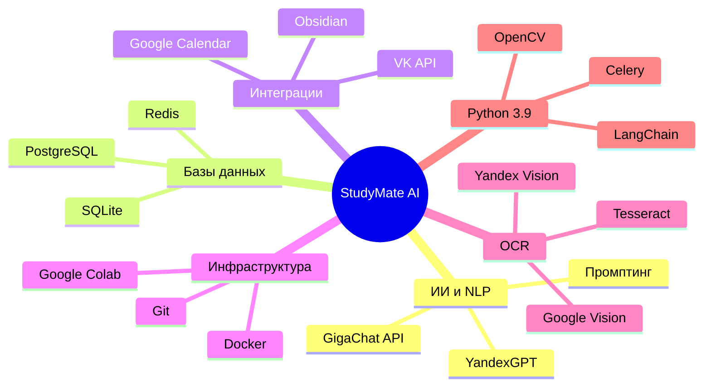

<h1 align="center">💜 Здравствуйте, Александра Николаевна! 💜</h1> 

  

<h2 align="center">👾 Мы рады снова вас видеть! 👾</h2> 

На этой странице всё-всё о нашем проекте по дисциплине ИТ-практикум!
 

🟣 Посмотрим, сможете ли вы составить своё расписание 🟣
 

## 🟪 Содержание

- [🟣 Описание функционала]()
  
- [🟣 Архитектура решения]()

- [🟣 Техническая документация]()

- [🟣 Вклад участников]()

- [🟣 Воспроизводимость]()

- [🟣 Тестирование]()

 

  

   

<h2 align="center">👾</h2> 

Мы создали интеллектуальный помощник в социальной сети ВКонтакте для того, чтобы взять на себя рутину планирования и сделать процесс обучения более осознанным и эффективным. Встроенный чат с искусственным интеллектом понимает естественный язык. Достаточно лишь написать и бот сам извлечёт нужную информацию, предложит подтвердить действие и выполнит его. AI также умеет кратко пересказывать длинные конспекты и показывать ближайшие события по запросу. 
 

<h2 align="center">👾</h2> 

В отличие от обычных календарей, наш бот не просто хранит расписание, а активно взаимодействует со студентом: с помощью загруженных материалов он создаёт персонализированную базу для обучения. Все данные автоматически сохраняются в Google Drive в отдельной папке. В любой момент можно найти нужную заметку по названию или дате создания, а также просмотреть все конспекты по выбранному предмету
 

<h2 align="center">👾</h2> 

Для каждого конспекта можно поставить напоминание в Google Calendar с указанием определённой даты и времени. Команда «Что скоро?» показывает все ближайшие события из календаря на неделю вперёд. Так вы не пропустите дедлайн и всегда будете знать, что нужно повторить.
 

   

  

   

  

   

## 🟪 Анализ требований и ограничений

 

| Требование |	Влияние на архитектуру |
| ------------- | ------------- |
| **Работа в VK (бот для социальной сети)** |	Использование VK API и VK Bot Long Poll, отсутствие необходимости в веб-сервере для основного функционала (только для OAuth). |
| **Интеграция с Google Drive и Google Calendar**	| Паттерн "Адаптер", представляющий собой отдельные классы DriveAPI и CalendarAPI, OAuth-авторизация через отдельный Flask-сервер для получения токенов. |
| **Использование AI (OpenAI-совместимые модели)** |	Слой абстракции, который позволит поддерживать любой API с интерфейсом OpenAI (базовый URL, ключ, модель задаются через переменные окружения), возможность смены модели без изменения кода. |
| **Хранение пользовательских данных** |	Хранение: состояние диалога, список предметов, выбранный предмет, временные данные, Google-токены, история AI-чата, персонаж AI. |
| **Понятный интерфейс с кнопками** |	Отдельный модуль со всеми клавиатурами, состояния пользователя управляются через БД, payload-кнопки для бесшовной навигации. |
| **Управление конспектами** |	Drive выступает как хранилище файлов в формате Markdown, бот не хранит содержимое конспектов в своей БД, атолько метаданные. |
| **AI-распознавание намерений** |	Наличие JSON-схемы, бот парсит ответ AI и извлекает его, подтверждение действий перед выполнением. |
| **Масштабирование на 1-5 предметов** |	Монолитная модульная архитектура, все модули независимы друг от друга. |
| **Возможность локального запуска и в Colab** |	Все зависимости в одном списке, отсутствие привязки к специфическим серверным технологиям, ОAuth-сервер может быть запущен на любом хосте с публичным URL. |

 

## 🟪 Обоснование выбора архитектурного стиля

 

1. Модульный монолит (Modular Monolith)

Мы выбрали модульный монолит как основной архитектурный стиль по следующим причинам:

- 🟣 Простота разработки и отладки.

- 🟣 Легкость развертывания.

- 🟣 Возможность параллельной работы.

- 🟣 Независимость и заменяемость модулей.

 

2. Слоистая архитектура (Layered Architecture)

Для организации кода внутри монолита используется луковая архитектура: 

🦐 Представление или Presentation (Клавиатуры, форматирование сообщений) --> `vk_view.py`
  
🦐 Контроллер или Controller (Логика обработки сообщений, состояния) --> `bot_controller.py`
  
🦐 Сервисы или Services (Внешние API, AI, бизнес-логика) --> `ai_helper.py`, `google_services.py`
  
🦐 Инфраструктура или Infrastructure (БД, OAuth-сервер, работа с токенами) `db.py`, `auth_server.py`

 

3. Паттерны проектирования

| Паттерн |	Где применяется? |	Зачем? |
| ------------- | ------------- | ------------- |
| **Адаптер (Adapter)** |	`google_services.py` (DriveAPI, CalendarAPI) |	Единый интерфейс для работы с Google API. |
| **Стратегия (Strategy)** |	`kb_*()` в `vk_view.py` |	Разные типы клавиатур под разные состояния. |
| **Команда (Command)** |	Payload-кнопки (`{'a': 'action', 'v': 'value'}`) |	Универсальный формат для действий пользователя. |
| **Шаблонный метод (Template Method)** |`st_*()` методы в `BotController`|	Единая сигнатура всех обработчиков состояний. |
| **Одиночка (Singleton)** |	`Database` (одно соединение), `client` в `ai_helper.py` |	Гарантирует единственный экземпляр подключения. |
| **Фасад (Facade)** |	`BotController` |	Упрощает взаимодействие между VK, БД, Google API и AI. |

 

## 🟪 Схема архитектуры

 

<pre>
┌─────────────────────────────────────────────────────────────┐
│                   КЛИЕНТСКИЙ СЛОЙ                           │
│  ┌─────────────────────────────────────────────────────┐    │
│  │        VK Messenger (Пользователь)                  │    │
│  └─────────────────────────────────────────────────────┘    │
└─────────────────────────────────────────────────────────────┘
                              │
                              ▼
┌─────────────────────────────────────────────────────────────┐
│                    СЛОЙ ПРЕДСТАВЛЕНИЯ                       │
│  ┌─────────────────────────────────────────────────────┐    │
│  │        vk_view.py (Клавиатуры и форматирование)     │    │
│  └─────────────────────────────────────────────────────┘    │
└─────────────────────────────────────────────────────────────┘
                              │
                              ▼
┌─────────────────────────────────────────────────────────────┐
│                     СЛОЙ КОНТРОЛЛЕРА                        │
│   ┌─────────────────────────────────────────────────────┐   │
│   │     bot_controller.py (BotController, состояния)    │   │
│   └─────────────────────────────────────────────────────┘   │
└─────────────────────────────────────────────────────────────┘
          │                    │                    │
          ▼                    ▼                    ▼
┌─────────────────────────────────────────────────────────────┐
│                       СЛОЙ СЕРВИСОВ                         │
│   ┌──────────────┐  ┌──────────────┐  ┌──────────────┐      │
│   │ ai_helper.py │  │ google_      │  │  auth_       │      │
│   │   (OpenAI-   │  │ services.py  │  │  server.py   │      │
│   │  compatible) │  │ (Drive,Cal)  │  │   (OAuth)    │      │
│   └──────────────┘  └──────────────┘  └──────────────┘      │
└─────────────────────────────────────────────────────────────┘
          │                    │                    │
          ▼                    ▼                    ▼
┌─────────────────────────────────────────────────────────────┐
│                   СЛОЙ ДОСТУПА К ДАННЫМ                     │
│   ┌─────────────────────────────────────────────────────┐   │
│   │         db.py (SQLite, таблица users)               │   │
│   └─────────────────────────────────────────────────────┘   │
└─────────────────────────────────────────────────────────────┘
          │                    │                    │
          ▼                    ▼                    ▼
┌─────────────────────────────────────────────────────────────┐
│                      ВНЕШНИЕ СЕРВИСЫ                        │
│  ┌──────────────┐  ┌──────────────┐  ┌──────────────┐       │
│  │    VK API    │  │ Google Drive │  │   Google     │       │
│  │              │  │              │  │  Calendar    │       │
│  └──────────────┘  └──────────────┘  └──────────────┘       │
│  ┌──────────────┐                                           │
│  │   OpenAI-    │                                           │
│  │  compatible  │                                           │
│  │     API      │                                           │
│  └──────────────┘                                           │
└─────────────────────────────────────────────────────────────┘
</pre>

 

### 👾 Описание потоков данных

  1. Пользователь --> VK API --> BotController: Сообщения и нажатия кнопок.

  2. BotController --> Google Services: Создание/чтение файлов в Drive и событий в Calendar.

  3. BotController --> AI Helper: Генерация ответов и распознавание намерений.

  4. BotController --> DB: Сохранение состояний, предметов, истории диалогов.

  5. Auth Server --> Google OAuth: Получение и обновление токенов доступа.

 

  

<h2 align="center">👾</h2> 

С технической точки зрения наш проект – это интеллектуальный ORM-конвейер, объединяющий возможности обработки естественного языка, оптического распознавания символов и классического планировщика задач.
 

 

### 📱 Как начать работу?

1. Перейдите в диалог с нашим ботом ВКонтакте.

2. Отправьте любое сообщение – бот ответит ссылкой для авторизации.

3. Перейдите по ссылке и разрешите доступ к Google Drive и Google Calendar.

4. Готово! Вы в главном меню.

 

### 🏠 Главное меню

После авторизации вас встретят три основные кнопки:

| Кнопка |	Что делает? |	
| ------------- | ------------- | 
| **Предметы** |	Управление учебными предметами и конспектами |	
| **Что скоро?** |	Показывает ближайшие события из календаря |	
| **ИИ-чат** |	Умный помощник, который понимает обычные фразы |	

 

 

 

### 📚 Работа конспектами

- 🟣 Добавить предмет:  
Нажмите «Предметы», «+ Добавить предмет», а затем введите название необходимой дисциплины.

- 🟣 Выбрать предмет:   
Нажмите на название предмета в списке.

- 🟣 Создать конспект:   
Выберите предмет, нажмите «Написать конспект», введите соответствующие название и текст, бот сохранит файл в Google Drive и предложит поставить напоминание.

- 🟣 Найти конспект:   
Выберите предмет, нажмите «Поиск / Просмотр», ищите конспект в списке по названию, дате или смотрите все.

 

 

 

### ⏰ Напоминания

- 🟣 После создания конспекта:  
Бот спросит: «Поставить напоминание в календаре?» — нажмите «Да» и выберите дату и время.

- 🟣 Просмотр ближайших событий:  
Нажмите «Что скоро?» в главном меню – бот покажет все напоминания на ближайшую неделю.

 

 

 

### 🤖 ИИ-чат

Самый удобный способ взаимодействия. Просто пишите обычными фразами:

| Что мне сказать? |	Что сделает бот? |	
| ------------- | ------------- | 
| «Сохрани как конспект по физике: закон Ома гласит...» |	Создаст конспект и предложит сохранить. |	
| «Напомни завтра в 19:00 подготовиться к экзамену» |	Создаст событие в календаре. |	
| «Что у меня запланировано на завтра?» |	Покажет ближайшие события. |	
| «Перескажи кратко мой последний конспект» |	Сделает краткую выжимку. |	

**Важно**: Перед сохранением или созданием напоминания бот обязательно спросит подтверждение — ничего не произойдёт без вашего согласия.

 

 

 

### ❓ Частые вопросы

**Где хранятся мои конспекты?**   
В Google Drive, в папке «Obsidian_Bot». Ссылка приходит после сохранения.

**Могу ли я редактировать конспект?**   
Да, через Google Drive — ссылка открывает файл в браузере.

**ИИ-чат бесплатный?**   
Да, всё бесплатно.

**Что делать, если бот не отвечает?**   
Проверьте подключение к интернету или напишите через пару минут.

 

<table>
  <tr>
    <td align="center">
      
       
    </td>
    <td align="center">
      
       
    </td>
  </tr>
</table>

 

<h2 align="center">👾</h2> 

Система спроектирована так, чтобы быть интуитивно понятной пользователю в плане взаимодействия, с ней сможет справиться любой студент нашего университета.
 

   

```mermaid
%%{init: {'theme': 'default', 'themeVariables': {
  'primaryColor': '#2c3e50',
  'primaryTextColor': '#fff',
  'primaryBorderColor': '#7f8c8d',
  'lineColor': '#34495e',
  'secondaryColor': '#34495e',
  'tertiaryColor': '#fff'
}}}%%
mindmap
  root((StudyMate AI))
    ИИ и NLP
      GigaChat API
      YandexGPT
      Промптинг
    Базы данных
      PostgreSQL
      SQLite
      Redis
    Интеграции
      Google Calendar
      Obsidian
      VK API
    Инфраструктура
      Google Colab
      Docker
      Git
    OCR
      Tesseract
      Yandex Vision
      Google Vision
    Python 3.9
      LangChain
      Celery
      OpenCV
```

   
 

  

   

| Участник           | Роль | Зона ответственности |
| ------------- | ------------- | ------------- |
| **Свистун Софья** | ⚙️ Хранитель Git, тестировщик | Полное ведение репозитория: создание и заполнение ReadMe, контроль количества коммитов (минимум 45 на команду), управление организацией в Git, просмотр и контроль функционала продукта. |
| **Хархавкина Мария** | 📜 Летописец | Создание, ведение и заполнение итогового отчёта. Описание работы каждого члена команды. Подготовка научных тезисов (постановка задачи, подход, архитектура, результаты). |                                                                                        
| **Мирошник Мария** | 🎤 Маг презентации, тестировщик | Выступление и полное оформление презентации (слайды 24+). Создание коммерческой презентации продукта (проблема, ЦА, ценность, демо). А также: добровольное согласие на получение пинков за всю команду, просмотр и контроль функционала продукта. |                  
| **Микуров Дмитрий** | 💻 Фулл-стек разработчик | Разработка модулей: database.py (структура БД, работа с расписанием и дедлайнами), reminder_system.py (умные напоминания), task_helper.py (разбивка задач на шаги), а также главный интерфейс main.ipynb. |                             
| **Кокорев Михаил** | 💻 Бэкенд-разработчик | Разработка модуля gigachat_connector.py: подключение к GigaChat API, отправка запросов, обработка ошибок, тестирование соединения. |  

 

--- 

## 🟪 План реализации проекта

  

- 🟣 а) Настройка подключения к GigaChat
    Реализация модуля gigachat_connector.py.

- 🟣 б) Проектирование базы данных
    Создание структуры SQLite, написание модуля database.py.

- 🟣 в) Разработка логики напоминаний и помощника
    Создание модулей reminder_system.py и task_helper.py.

- 🟣 г) Создание пользовательского интерфейса
    Разработка main.ipynb.

- 🟣 д) Интеграция и тестирование.

- 🟣 е) Подготовка отчёта и презентации.

  

---

  

## 🟪 Интересные факты о проекте

  

💟 Умные напоминания – бот не просто пишет "у вас пара", а генерирует дружеские сообщения, подбадривая студента.

💟 Декомпозиция задач – большая курсовая работа разбивается на мелкие шаги, чтобы не было страха перед "белым листом".

💟 Всё на одной платформе – расписание, дедлайны и напоминания собраны в единой базе данных.

  

   
 

  

   

   
 

  

   
